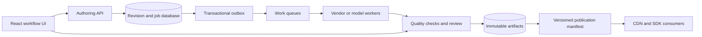

# Airbnb system design: question bank and follow-up answers

[Round-wise guide](README.md) · [Research evidence](Research-Sources.md) · [Role-specific JS/TS/React](05-JS-TS-React-and-I18n.md)

**Target:** Internationalization Infrastructure / Application Platform, using the job description supplied October 7, 2026. Designs here are original interview proposals, not claims about Airbnb's actual internal architecture.

## Which questions to study first

| Priority | Question | Why included |
| --- | --- | --- |
| 1 | D1 translation workflow platform | Directly inferred from your job description; not a reported interview question |
| 1 | D2 versioned localization libraries and delivery | Directly inferred from the job's libraries/guardrails pillar |
| 1 | D3 safe legacy migration and AI-assisted translation | Directly inferred from the job's migration and AI responsibilities |
| 1 | D4 booking and availability | June 2026 interview summary R2 |
| 1 | D5 internal ticket routing | Extra architecture round in R2 |
| 1 | D6 group chat and inbox | Aced June submission A2; January interview P1 |
| 2 | D7 A/B testing platform | July 2026 repost R3 |
| 2 | D8 listing search and split-stay API | Relevant marketplace practice; no recent firsthand report established here |
| 2 | D9 notifications and vendor integration | Transfer practice for translation workflows; not labeled recently asked |
| 3 | D10 weather-data ingestion | LeetCode account L2, date unverified; tests transfer beyond familiar product topics |

This is the complete design set selected for this guide, not an exhaustive list of what Airbnb can ask. [Source details](Research-Sources.md) distinguish interview dates from publication dates. The follow-ups below are suggested rehearsal questions unless explicitly identified as reported.

## Answer structure for every design

Use a 50-minute rehearsal: 5 minutes scope, 5 scale and invariants, 10 APIs/schema, 15 main flows and one deep dive, 10 failures/scaling, 5 metrics and rollout. If the interviewer narrows the task to schema and queries, follow that direction rather than forcing a memorized architecture.

Begin with a small useful system and state which workload forces each added component. Distinguish example estimates from known company figures. For example, **assume** 1 million source revisions/day × 20 target locales = 20 million translation tasks/day, about 231 tasks/second average. Peak multiplier, text length, vendor throughput, and quality-review capacity still need estimates.

## D1. Design a translation workflow platform

**Prompt:** Product teams author content; the platform translates it across locales using vendors or approved machine translation, routes review, and delivers approved versions to consumers. Support changing source text, retries, auditability, and a React operations UI.

**Clarify:** UI strings versus user-generated content? Target locales? Latency expectations? Which content requires human review? Are publication approvals per locale or all-or-nothing? Do vendors support idempotency or status lookup?

**Proposed model and APIs:**

- `content(content_id, source_locale, current_revision)` and immutable `content_revision(content_id, revision, text_hash, text, schema_version)`.
- `translation_job(job_id, content_id, revision, target_locale, policy_version, status, vendor, attempt, lease_until)` with unique logical-work key `(content_id, revision, target_locale, policy_version)`.
- `translation_artifact(job_id, output_revision, text, quality_result, provenance)`; `review_decision` and `publication_manifest` retain history.
- `POST /content/{id}/revisions`, `GET /jobs?locale=&status=&cursor=`, `POST /jobs/{id}/review` with expected version, and `POST /releases`.



**Main flow:** Persist a source revision and outbox event in one transaction. Consumers create locale jobs idempotently. Workers lease jobs, call a vendor, and record results with revision/attempt identity. Validate placeholders, format syntax, completeness, and policy checks before review. Publish immutable artifacts by switching a manifest only after required approvals. A result for an old source revision remains auditable but cannot silently overwrite the current one.

**Consistency boundary:** A source revision and its jobs are related through durable events; queues may redeliver. The publish decision must refer to explicit immutable revision IDs. Exactly-once external vendor billing cannot be guaranteed merely by putting a unique constraint in your database.

| Follow-up | Answer to develop |
| --- | --- |
| Source text changes while work is in flight? | Keep old and new revision identities separate. Mark old jobs superseded for current publication; retain their outcomes for audit and possible reuse only under explicit policy. |
| Worker crashes after vendor success? | Persist request identity before sending, use vendor idempotency/status lookup when available, reconcile ambiguous outcomes. Without vendor support, acknowledge duplicate-cost risk. |
| Vendor slows down or rate-limits? | Per-vendor quotas and bounded concurrency, exponential backoff with jitter, deadlines, circuit breaking, backlog metrics; use alternate vendors only when quality/data policy permits. |
| One locale fails? | Publish independently if the product contract allows it; otherwise hold the release. Show partial state clearly in the UI. |
| Two reviewers approve different edits? | Optimistic version check on review; reject stale writes and show a conflict-resolution view. Server authorizes every action. |
| How do you ensure fairness? | Separate urgent/high-risk work from bulk backfills with quotas; track oldest job age by tenant/locale, not only total throughput. |
| How do you protect content? | Minimize data sent to vendors, apply access control and retention policy, redact sensitive logs, use approved providers and audit exports. |

**Metrics:** p50/p95 end-to-end time by locale, approval/rework rates, stale publication count, cost per accepted unit of content, queue age, vendor timeout rate, and product-team adoption. Define denominators so “cheaper” does not merely mean shipping more low-quality output.

## D2. Design localization libraries and versioned content delivery

**Prompt:** Build shared JS/TS and backend libraries for message formatting and locale-aware content delivery, with consistent behavior across web and other platforms.

**Proposed answer:** Store message keys and typed placeholder schemas in a versioned registry. Compile/validate catalogs in CI. Publish immutable bundles keyed by application, locale, and release; distribute through object storage/CDN. Clients load a pinned manifest with explicit locale fallback, cache immutable artifacts, and report missing keys. Keep the library's API small: select locale, resolve catalog, format message, format dates/numbers, and expose diagnostics.

**Model:** `catalog_release(release_id, app_id, schema_version)`; `bundle(release_id, locale, content_hash, url)`; `message_schema(key, required_args, kinds)`; compatibility metadata for library versions. Use a supported message-format parser/runtime rather than inventing a regex parser for nested ICU messages.

| Follow-up | Answer to develop |
| --- | --- |
| Web and backend format the same message differently? | Share message schemas and cross-language golden tests; define locale, timezone, numbering and plural expectations. Do not assume runtime data versions always match. |
| Locale fallback? | Use a product-approved ordered policy such as requested locale → configured parent → default; detect cycles. Locale negotiation by `Intl` is not a translation-catalog fallback implementation. |
| Missing parameter? | Validate at build time when possible and guard at runtime. Decide safe fallback or visible failure by surface; avoid raw placeholders reaching guests silently. |
| Roll back a bad translation? | Atomically repoint the manifest to a known-good immutable release; keep client compatibility and cache TTL in the recovery plan. |
| CDN unavailable? | Use last-known-good compatible bundles if cached; define a default bundle strategy. Do not block the entire app indefinitely on an optional locale fetch. |
| SSR hydration mismatch? | Ensure server/client use the same locale, timezone assumptions, and catalog release. Avoid machine-local defaults for visible dates. |
| A huge catalog? | Split by route/domain, preload likely bundles, and track payload bytes plus miss latency. Preserve version coherence across loaded pieces. |

**Metrics:** missing-key rate, fallback rate by locale, bundle load p95, cache hit ratio, client error rate, payload size, and adoption across teams. Validate with pseudolocalization, right-to-left layouts, long text, plural categories, Unicode, and assistive-technology checks.

## D3. Migrate a legacy translation system and introduce AI safely

**Prompt:** Replace a legacy pipeline while exploring LLM-assisted translation. Improve quality, latency, operating cost, and developer productivity without breaking existing consumers.

**Migration answer:** Inventory producers, consumers, schemas, guarantees, and hidden workflows first. Introduce an adapter preserving the old API. Backfill versioned records with checkpointed, idempotent jobs. Shadow-read or shadow-process and compare normalized outcomes. Choose a single write authority; replicate through an outbox/change stream with conflict rules rather than uncontrolled dual writes. Canary by low-risk surface/locale, monitor, expand, and retire the old path only after consumer migration and rollback validation.

**AI answer:** Start with a narrow low-risk content category and offline representative evaluation by locale/domain. Compare against the current baseline using human review plus automated checks. Log model/prompt/glossary versions and source revision. Preserve placeholders and formatting. Treat source content as data, not instructions; model output cannot approve or publish itself. Roll out only when quality and cost/latency evidence supports it.

| Follow-up | Answer to develop |
| --- | --- |
| What are the rollback criteria? | Predefine translation errors, stale/missing content, latency, and operational-load thresholds. Roll back routing/manifest safely; reconcile writes created after cutover. |
| How do you compare systems? | Compare semantic records, schemas, decisions, and consumer-visible behavior. Text equality alone may be inappropriate for nondeterministic translation; human quality review still matters. |
| Model version changes? | Pin versions where supported, rerun regression evals, canary changes, and retain provenance for investigation. |
| Quality improves globally but worsens in one locale? | Require per-locale/domain guardrails and sample coverage. Aggregate averages can hide harmful regressions. |
| What constitutes success? | Accepted quality at lower cost or faster delivery, reduced manual work, higher adoption, and lower incident burden—measured against a documented baseline. |
| Vendor outage during migration? | Maintain a tested fallback and suspend noncritical backfills. Avoid using the migration as a reason to bypass approval controls. |
| Prior ML specialization required? | The supplied role says it is not required. Demonstrate sound experimentation, verification, and production judgment; collaborate with ML specialists where needed. |

## D4. Booking and availability

**Evidence:** R2 reports a booking design with pagination/indexing follow-ups. The proposed architecture below is our solution, not the candidate's or Airbnb's implementation.

**Prompt:** Search availability, hold every night of a stay, confirm after payment, and support cancellation without double booking.

**Model:** `listing`; precreated `listing_night(listing_id, local_date, owner_reservation_id)` with primary key `(listing_id,local_date)`; `reservation(id,guest_id,status,hold_expires_at,version)`; `payment_attempt`; and scoped `idempotency_request(actor_id,key,payload_hash,result)`. Model dates in the listing's local calendar; payment timestamps are instants.

**Write flow:** In one transaction lock all requested night rows in deterministic date order, verify all are available under the hold-expiry policy, claim them, and create the reservation/outbox event. On failure roll back all claims. A separate payment workflow uses idempotent requests, reconciles ambiguous results, and confirms only while the reservation still owns its nights. A late success after expiry must not steal inventory from a newer reservation; void/refund according to the payment state.

| Follow-up | Answer to develop |
| --- | --- |
| Two simultaneous requests? | The same authoritative inventory rows serialize conflicting claims. A cached availability check alone is insufficient. |
| Missing night rows? | Precreate inventory or use transactional insertion/constraints with conflict handling; locking a query that returns no rows does not lock nonexistent inventory. |
| Payment succeeds and response times out? | Query/reconcile the existing payment attempt using its stable identity before charging again. |
| Expiry worker races with confirmation? | Lock/check reservation status/version and ownership under one consistent transition policy. Both transitions must enforce the same deadline rule. |
| Reservation history pagination? | Cursor on `(created_at,id)` with a stable tie-breaker; index `(guest_id,created_at DESC,id DESC)`. Bind cursors to the filter/sort contract. |
| Multi-region writes? | Start with one write owner per listing/partition and failover fencing. State the latency/availability trade-off rather than assuming multi-master writes preserve exclusive inventory. |

Example query for history after a cursor, with the first-page case handled separately:

```sql
SELECT id, created_at, status
FROM reservation
WHERE guest_id = $1 AND (created_at, id) < ($2, $3)
ORDER BY created_at DESC, id DESC
LIMIT $4;
```

**Index explanation:** Equality on guest narrows the scan; ordered timestamp/ID supports the requested traversal. Validate plans and distributions instead of claiming every index always removes sorting. [PostgreSQL multicolumn index reference](https://www.postgresql.org/docs/current/indexes-multicolumn.html)

## D5. Internal support-ticket routing

**Evidence:** R2's extra round concerns tickets from multiple sources, agent eligibility, claiming, and time-window metrics.

**Prompt:** Agents view eligible tickets based on language/location and claim one. Managers need backlog and response-time metrics. This maps well to translation-review operations too.

**Model:** `ticket(id,external_source,external_id,language,region,status,priority,created_at,claimed_by,claim_version,lease_until)`; `agent_skills`; immutable `ticket_event`. Deduplicate ingestion by `(external_source,external_id)`. Begin with a transactional database and query indexes matching the actual eligibility filters; avoid designing every possible filter combination up front.

**Claim flow:** Check authorization/eligibility server-side; select and lock an eligible unclaimed ticket in a transaction, update claimant/lease/version, record an event, commit. Expired claims are reclaimed with version checks. Use a durable event pipeline for analytics; distinguish event time from ingestion time.

| Follow-up | Answer to develop |
| --- | --- |
| Two agents click claim? | A conditional update or row lock makes only one claim succeed; return the losing client a conflict. |
| Need workers to claim the next available item? | `FOR UPDATE SKIP LOCKED` can reduce contention in queue-like consumption. It does not provide a consistent general-purpose reporting snapshot. |
| Agent disappears? | Lease/heartbeat with bounded duration; stale agent updates must present the current claim token/version. |
| Strict priority and fairness? | Specify whether skipping locked high-priority work is acceptable; use aging/quotas and monitor oldest-item age, not just average wait. |
| Language and region rules change? | Version rules; revalidate before claim. Cached eligibility is advisory. |
| Metrics are duplicated or late? | Deduplicate by event ID, keep event-time windows with a lateness policy, and reconcile aggregates against durable history. |

[PostgreSQL locking semantics](https://www.postgresql.org/docs/current/sql-select.html) support the queue-consumption technique; the domain policy is our proposed design. Observe claim conflicts, abandoned leases, time-to-first-response, oldest backlog, and routing accuracy.

## D6. Group chat, inbox, and message history

**Evidence:** A2 and P1 report group-chat design. The unverified-age L1 account also lists inbox/schema follow-ups. The following is an original design.

**Prompt:** Create a group, send a message, show conversation history, and list the user's ten most recently active conversations.

**Model:** `conversation(id,version,last_message_at)`; `membership(conversation_id,user_id,role,joined_at,left_at)`; `message(conversation_id,sequence,id,sender_id,client_message_id,body,created_at)`; optionally `user_inbox(user_id,conversation_id,last_activity,last_read_sequence)`. Enforce sender membership and idempotency of `(conversation_id,sender_id,client_message_id)`.

**Flow:** Persist messages durably, assign per-conversation ordering, and publish outbox events. Deliver over live connections if available; offline clients resume from a cursor. Update inbox activity monotonically so delayed events cannot move a conversation backward. Index message history by conversation and sequence, inbox by user/activity/conversation tie-breaker.

| Follow-up | Answer to develop |
| --- | --- |
| Duplicate send after reconnect? | Return the stored message for the same client message ID; reject changed payload under the same key. |
| Stable pagination? | History uses sequence cursors. An actively changing inbox needs a declared snapshot or best-effort live-feed policy; a cursor alone does not freeze ranking. |
| Huge group? | Reassess fan-out-on-write to every inbox; combine conversation activity with membership reads or hybrid fan-out. |
| Reuse a participant group on another reservation? | Canonicalize participant IDs with unambiguous encoding, but retain reservation-specific conversation authorization. Membership changes require explicit versioning. |
| Out-of-order events? | Per-conversation sequence, monotonic update checks, gap detection and reload. Global total ordering is unnecessary. |
| Cross-region outage? | Define write authority, replication lag, reconnect behavior, and recovery point. A queue does not automatically imply zero data loss. |

**Metrics:** durable-ack p95, delivery delay, missing/duplicate message rate, inbox lag, reconnect recovery, and unauthorized-access failures.

## D7. A/B testing platform

**Evidence:** R3 names an A/B **platform** design. This is different from answering the statistical design question in the earlier workbook.

**Prompt:** Teams configure experiments, assign stable variants, log exposure, monitor guardrails, and analyze results.

**Architecture:** Versioned experiment configuration with approvals → cached SDK evaluator → deterministic salted assignment for a chosen unit → exposure events → durable ingestion → deduplicated warehouse tables → metric computation/dashboard. Model experiment versions, allocation, eligibility, mutual-exclusion groups, assignments/exposures, and outcome definitions. Keep a kill switch and audit log.

| Follow-up | Answer to develop |
| --- | --- |
| Ramp from 1% to 10% without reassigning everyone? | Stable hash buckets with reserved ranges; preserve assigned variants and version allocation policies intentionally. |
| SDK offline? | Define cached-config expiry and safe default behavior per feature; log config version used. |
| Assignment versus exposure? | Assignment records intended treatment; exposure records actual delivery. Do not redefine primary analysis by post-treatment adoption without causal justification. |
| Sample-ratio mismatch? | Investigate assignment, eligibility, instrumentation and data-loss issues before interpreting effect estimates. |
| Marketplace interference? | Consider clustered or switchback designs with suitable analysis; guest-level independence is an assumption, not a fact. |
| AI translation experiment? | Gate by content risk and locale, pin model/prompt versions, measure reviewed quality and cost alongside latency. |

For a worked effect-size and confidence-interval answer, see [A/B causal analysis](../Candidate-Questions-and-Solutions.md#6-design-an-ab-test-with-causal-inference).

## D8. Listing search and split-stay API

**Status:** Marketplace transfer practice; not marked as a newly verified interview report.

**Prompt:** Search by location, dates, guests, price, and amenities; offer one- or two-listing stays when a single listing cannot cover the whole trip.

**Answer outline:** Source-of-truth listing and inventory stores feed a search index asynchronously. Retrieve/filter candidates, consult availability, rank, and return a cursor. A split-stay service intersects prefix/suffix availability for a bounded candidate set and ranks feasible pairs. Search results are advisory; booking validates and claims authoritative inventory. Avoid building all pairs across the entire catalog.

| Follow-up | Answer to develop |
| --- | --- |
| Stale search availability? | Carry freshness/version information and revalidate at booking; measure false-positive availability. |
| Ranking changes between pages? | Use a search-session snapshot or documented live semantics with stable tie-breakers/deduplication. |
| Split-stay explosion? | Bound geography/candidate count, prefilter dates/capacity, and use top-k ranking; state the recall trade-off. |
| Price/currency differences? | Preserve currency and price-version identity; obtain a final quote under explicit expiry rules. |
| Localization affects search? | Separate localized presentation from canonical filters/IDs; language-aware tokenization and relevance need evaluation by locale. |

## D9. Notification and vendor-dispatch service

**Status:** Role-derived transfer exercise for asynchronous integration.

**Prompt:** Send translation-completion or review notifications by email, push, or internal inbox, honoring preferences and vendor quotas.

**Answer outline:** Persist notification intent and outbox event; validate recipient/channel policy; schedule by priority/deadline; dispatch via provider adapters; record attempt IDs and receipts. Retry transient failures with bounded backoff; route permanent failures for review. Separate “accepted by provider” from “seen by user.” Templates are versioned/localized artifacts.

| Follow-up | Answer to develop |
| --- | --- |
| Duplicate events? | Logical notification ID plus provider idempotency when supported; at-least-once queues alone do not prevent duplicate external sends. |
| Provider accepted but timed out? | Reconcile status if supported; define duplicate-versus-delay trade-off explicitly. |
| Quiet hours? | Evaluate the recipient's timezone and policy; urgent security/transactional exceptions need explicit rules. |
| Locale changes during retry? | Decide whether the notification pins locale/template at creation or re-evaluates at send; retain the decision in audit data. |
| Large backfill overwhelms urgent work? | Separate quotas/queues, bounded concurrency, and deadline-aware scheduling. |

## D10. Weather-data ingestion and historical queries

**Evidence:** L2, report date unverified. Included to test architecture transfer rather than memorizing marketplace prompts.

**Prompt:** Ingest region-station observations, query history by location/time, and expose forecasts.

**Answer outline:** Station identity/authentication → validated ingestion API → durable partitioned stream → deduplicated time-series storage/object archive → aggregation/query service. Key observations by station and measurement identity/time. Treat forecasting as a separate versioned computation pipeline with freshness and quality metadata.

| Follow-up | Answer to develop |
| --- | --- |
| Late or duplicate observations? | Event-time processing, deduplication identity, bounded correction windows and versioned aggregates. |
| Station clock drift? | Store observation and receive timestamps; flag implausible drift rather than silently reordering reality. |
| Regional hot spots? | Partition with query/load patterns in mind; avoid a single hot regional key. |
| Bad sensor reading? | Preserve raw data, attach validation/quality status, and prevent invalid data silently contaminating forecasts. |
| Historical backfill? | Isolate capacity, make jobs restartable/idempotent, and communicate corrected query versions. |

## Readiness check

For each priority-one design, produce one diagram, three concrete APIs, the main tables/keys, one end-to-end request, two failure traces, and metrics. Rehearse the follow-up answers aloud. A strong answer connects each component to a requirement and can simplify when scale or scope does not justify it.
